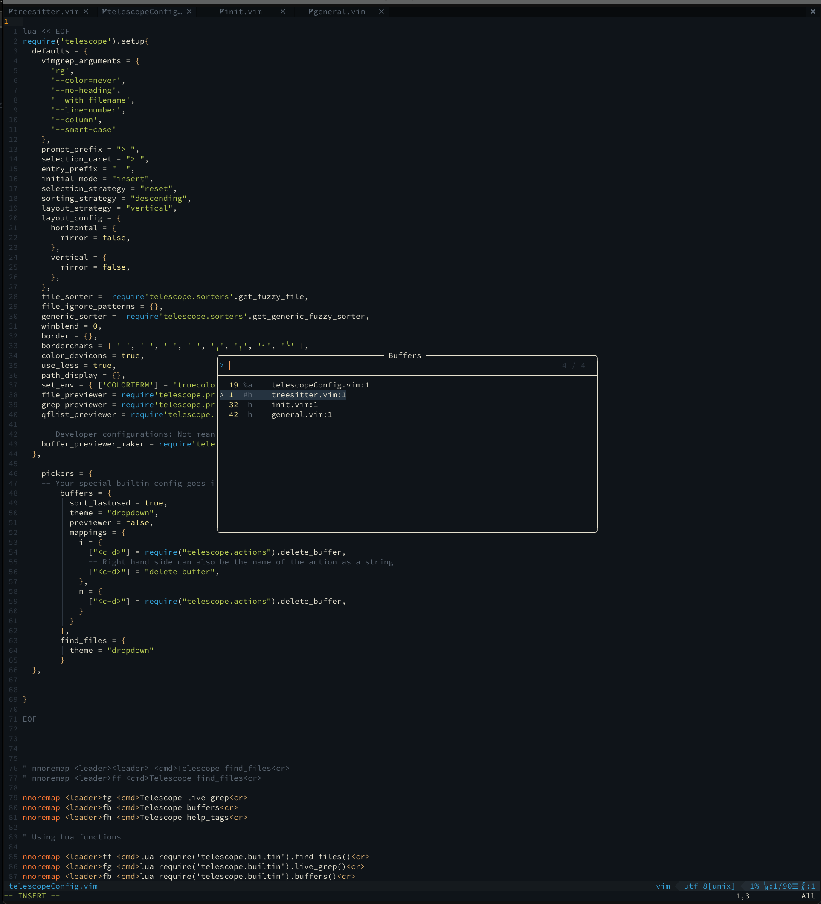
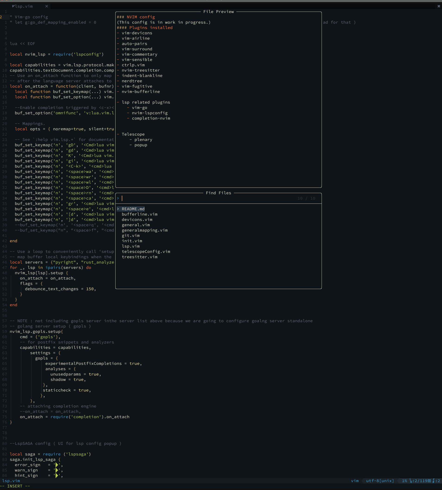
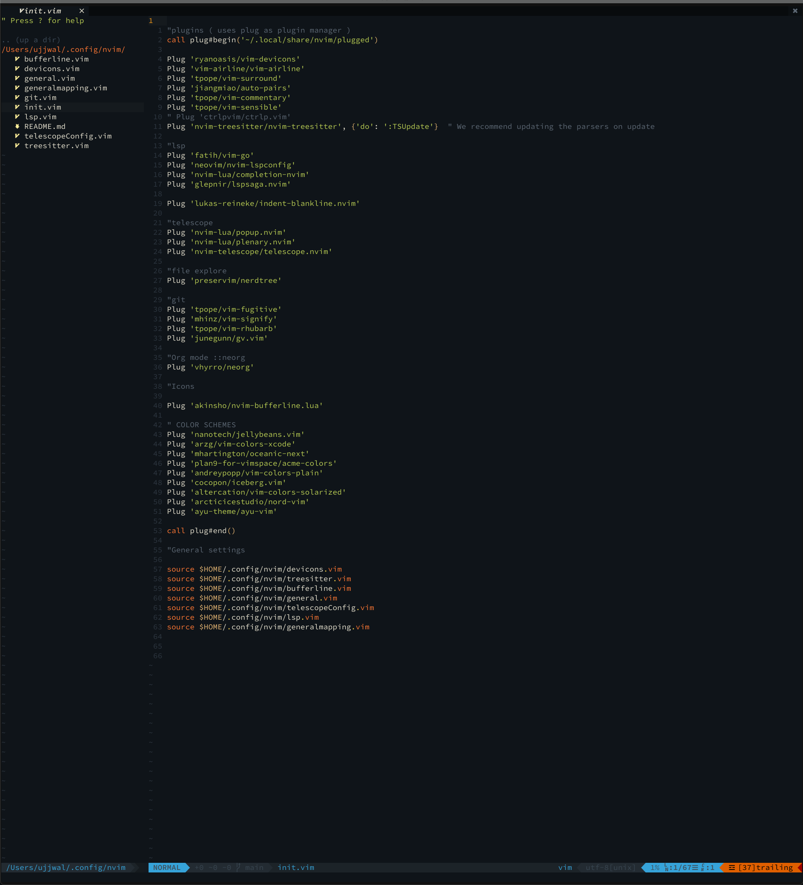

### NVIM config 
(This config is in work in progress.) 
#### Plugins installed
- vim-devicons
- vim-airline
- auto-pairs
- vim-surround
- vim-commentary
- vim-sensible
- ctrlp.vim
- nvim-treesitter
- indent-blankline
- nerdtree
- vim-fugitive
- nvim-bufferline

- lsp related plugins  
    - vim-go 
    - nvim-lspconfig
    - completion-nvim

- Telescope 
     - plenary
     - popup

# Screenshots
### Buffer lister
- 
### File Finder
- 
### NERDtree 
- 
